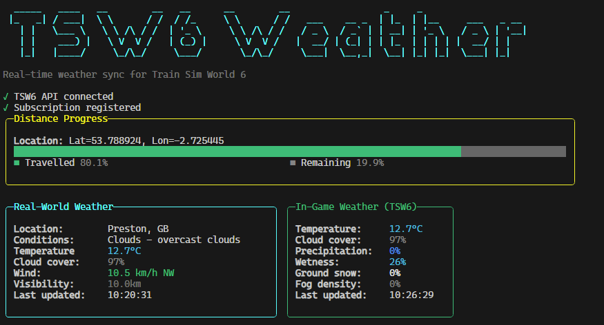

# tsw6-realtime-weather
Realtime weather mod for Train Sim World, using open data.

Synchronizes real-world weather conditions with Train Sim World 6 based on your exact location in the game. As you drive your train through different regions, the application automatically fetches and displays current weather data from OpenWeather API.

## Example Output



The application displays two main panels:
- **Distance Panel**: Shows your current location coordinates and travel progress with a visual progress bar
- **Weather Panel**: Displays comprehensive weather information with color-coded values and emoji indicators

⚠️ **Warning messages** only appear when there are issues that need attention (missing API keys, TSW6 not connected, etc.)

## Download

Download the [latest release](https://github.com/GarethLowe/tsw6-realtime-weather/releases/latest) from the Releases page.

## Setup

### Prerequisites
1. Train Sim World 6 installed
2. OpenWeather API key (free tier available at https://openweathermap.org/api)

### Installation
1. Download the latest release
2. Extract to a folder of your choice
3. Configure the application (see Configuration section below)
4. Launch Train Sim World 6 with the `-HTTPAPI` flag
5. Run `tsw6-realtime-weather.exe`

## Configuration

The application uses a `config.yaml` file for configuration. On first run, a default configuration file will be created automatically.

### Configuration Options

#### Weather Settings
- **`weather.update_threshold_km`** (default: 10.0)
  - Distance in kilometers the player must travel before new weather data is fetched
  - Lower values = more accurate weather but more API calls
  - Recommended range: 10-50 km
  - Example: `update_threshold_km: 25.0` to update every 25 km

#### Update Timing
- **`update.location_check_interval_seconds`** (default: 60)
  - How often (in seconds) the application checks the player's location
  - Lower values = more responsive but higher CPU usage
  - Recommended range: 30-120 seconds
  - Example: `location_check_interval_seconds: 45` to check every 45 seconds

#### HTTP Retry Settings
- **`retry.max_retries`** (default: 5)
  - Maximum number of retry attempts for failed HTTP requests
  - Uses exponential backoff between retries
  - Set to 0 to disable retries
  - Example: `max_retries: 3` for fewer retries
  
- **`retry.initial_delay_ms`** (default: 100)
  - Initial delay in milliseconds before the first retry
  - Subsequent retries use exponential backoff (100ms → 200ms → 400ms → 800ms → 1600ms)
  - Example: `initial_delay_ms: 200` for longer initial wait

#### API Keys
- **`api_keys.openweather`** (optional)
  - Your OpenWeather API key
  - If left empty, the application will fall back to reading from `WeatherApiKey.txt`
  - Recommended: Store your API key in the config file for easier management
  - Example: `openweather: "your_api_key_here"`

#### Logging Settings
- **`logging.level`** (default: Information)
  - Minimum logging level: Debug, Information, Warning, Error
  - **Debug**: Verbose logging including all location updates and distance calculations
  - **Information**: Standard operational logging (recommended for normal use)
  - **Warning**: Only warnings and errors (includes retry attempts)
  - **Error**: Only error messages
  - Example: `level: Debug` for troubleshooting

### Example config.yaml

```yaml
weather:
  update_threshold_km: 15.0

update:
  location_check_interval_seconds: 45

retry:
  max_retries: 5
  initial_delay_ms: 100

logging:
  level: Information

api_keys:
  openweather: "your_openweather_api_key_here"
```

### Legacy API Key File
For backward compatibility, you can still use a `WeatherApiKey.txt` file instead of adding the key to `config.yaml`. Simply create a text file named `WeatherApiKey.txt` in the same folder as the executable and paste your OpenWeather API key into it.

Priority: The application checks `config.yaml` first, then falls back to `WeatherApiKey.txt`.

## Features
- 🌦️  **Real-time weather synchronization** - Fetches weather from OpenWeather API and updates TSW6 game weather
- 📍 **Automatic location tracking** via TSW6 HTTP API
- 🚂 **Distance-based updates** - Weather refreshes after traveling configured distance (default: 10km)
- 📊 **Clean terminal UI** - Compact display with distance tracking and detailed weather information
- 🎨 **Color-coded display** - Temperature colors from blue (cold) to red (hot), dynamic wind and cloud colors
- ⚠️  **Smart warnings** - Status messages only appear when issues need attention
- ⚙️  **Fully configurable** - Update intervals, distance thresholds, logging levels, retry behavior
- 🔄 **HTTP retry resilience** - Automatic recovery from network issues with exponential backoff
- 📝 **Comprehensive logging** - File and console logging with configurable verbosity
- 🎯 **Native AOT compilation** - 14.5MB executable, no .NET runtime required

### Weather Information Displayed
- 📍 Location (city name and country)
- 🌤️  Current conditions with weather emoji (sunny ☀️, rainy 🌧️, cloudy ☁️, etc.)
- 🌡️  **Temperature** - Color-coded from blue (freezing) through green (comfortable) to red (hot)
- ☁️  **Cloud cover** - Percentage with dynamic colors
- 🌧️  **Precipitation** - Rain and snow intensity when present
- 💨 **Wind** - Speed, direction (N/NE/E/etc.), and gusts with color coding
- 💧 **Humidity** | 🔽 **Pressure** | 👁️ **Visibility** - All on one compact line
- ⏰ Last update timestamp

## How It Works
1. The application connects to the TSW6 HTTP API (localhost:31270) to monitor your position in-game
2. As you drive your train, it tracks your movement distance using the Haversine formula
3. When you've traveled the configured threshold distance (default: 10km):
   - Fetches current weather data from OpenWeather API based on your exact coordinates
   - Converts the weather data to TSW6 format (temperature, cloudiness, precipitation, wetness, ground snow, fog density)
   - Updates the TSW6 game weather via PATCH requests to the HTTP API
4. The real-world weather now matches your in-game environment!

## Troubleshooting

### Warning: "TSW6 not connected"
Make sure you launched Train Sim World 6 with the `-HTTPAPI` flag. You can add this to your Steam launch options:
1. Right-click TSW6 in Steam → Properties
2. Under Launch Options, add: `-HTTPAPI`
3. Launch the game, then run the application

### Warning: "API keys not found"
- Add your OpenWeather API key to `config.yaml` under `api_keys.openweather`, OR
- Create a `WeatherApiKey.txt` file in the same folder as the executable with your API key

### Warning: "Subscription not active"
This means the TSW6 HTTP API subscription hasn't been established yet. Simply start driving your train and the subscription will activate automatically.

### Weather not updating in-game
- Verify you can see weather changes in the application's Weather panel
- Check the logs for any PATCH request errors
- Try restarting TSW6 with the `-HTTPAPI` flag
- Make sure no firewall is blocking localhost connections

## Building from Source

### Prerequisites
- .NET 9.0 SDK or later
- Windows, Linux, or macOS

### Build Commands

#### Development Build
```powershell
dotnet build
```

#### Release Build (AOT Compiled)
```powershell
# Windows x64
dotnet publish -c Release -r win-x64 --self-contained -p:PublishAot=true -o ./publish

# The executable will be in ./publish/tsw6-realtime-weather.exe
```

### Automated Builds

The project includes a GitHub Actions workflow that automatically builds on every push to `main`:

1. **Automatic**: Push to main triggers a build
   ```bash
   git push origin main
   ```

2. **Manual**: Go to Actions → Build → Run workflow

The workflow produces a ZIP artifact containing:
- Native AOT compiled executable (no .NET runtime required)
- Configuration template (`config.yaml`)
- Documentation (`README.md` and `QUICKSTART.txt`)

Artifacts are available in the Actions tab and can be used to create releases manually.

## License
MIT License - feel free to modify and distribute.
